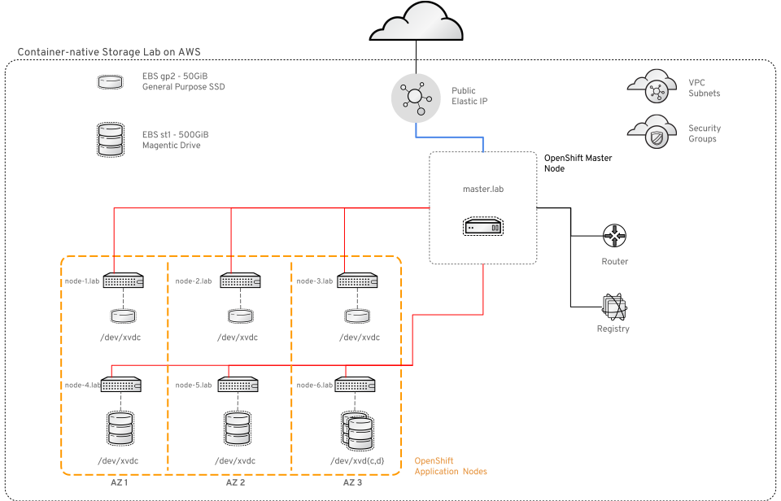

# Welcome to Container-Native Storage Hands-on Lab

This lab guide is designed for self-paced walk-through of the "Container-Native Storage on OpenShift 3.5" hosted on [redhat.qwkilab.com](https://redhat.qwiklab.com). This lab gives you access to a fully functional OpenShift Container Platform 3.5 environment hosted on AWS.

#### Pre-requisites

For this lab you need to fulfill the following pre-requisites:

- Workstation with Internet access

- SSH client supporting authentication with a private key

---

#### Get Lab Access Credentials

Your lab should be pre-provisioned. If that's for some reason not the case you'll see this progress bar:

If you don't see that your lab infrastructure is ready. When this is the case you will additional blue buttons (3 in total) on the right.

In order to access the lab infrastructure click the &nbsp;&nbsp;Connect&nbsp;&nbsp; button and the &nbsp;&nbsp;Addl. Info&nbsp;&nbsp; (will be visible when the lab is readily provisioned) on the right side of the screen to obtain the following access information:

|Type | Name | |
|------------| -------- |-------- |
|SSH Key  | PEM File | *download this file by clicking <kbd>Download PEM/PPK</kbd> > <kbd>Download PEM</kbd>* in the "Connect" pane|
|URL to OpenShift UI| OpenShiftLoginURL |e.g. *https://34.226.81.9.nip.io:8443/* |
|IP to Lab Environment | MasterNodePublicIP |e.g. *34.226.81.9* |

The lab has a number of user account definitions:

|Type | Username | Password | notes |
|------------| -------- |-------- |-------- |
|Linux user on Master node  | ec2-user | *authenticated via SSH by PEM file*| passwordless sudo access on all systems |
|OpenShift Admin-persona User | operator | `r3dh4t` | will get cluster-admin privileges in the lab |
|OpenShift Developer-persona User | developer | `r3dh4t` | no special permissions |

---

#### Access the Lab environment

The lab will provision a readily installed OpenShift environment.

You access the lab environment in two ways:

- via the web-based OpenShift UI using your browser pointing to the *OpenShiftLoginURL* using either of the two OpenShift users defined above

- via SSH to the OpenShift Master node with the *MasterNodePublicIP* using the `ec2-user` and the PEM file

&#8680; To login via SSH download the PEM file to your machine and change the permissions:

    chmod 0400 ~/Downloads/<pem-file-name>

&#8680; Then login with the ssh client like this:

    ssh -i ~/Downloads/<pem-file-name> -l ec2-user <MasterNodePublicIP>

The Master node also functions as your *jumpserver*. Once you are logged on to it you have access to all systems with the `ec2-user` who has passwordless authentication and passwordless sudo capabilities set up everywhere.

---

#### Lab Environment IP addresses

The lab environment has 7 nodes in total with stable, internal IP addresses and `/etc/hosts`-based DNS resolution. All nodes have internet access. Only the Master can be reached from the Internet via it's public IP however.

|Host | FQDN | IP address |
|------------| -------- |-------- |
|OpenShift Master| master.lab | 10.0.1.100 |
|OpenShift App Node 1| node-1.lab | 10.0.2.101 |
|OpenShift App Node 2| node-2.lab | 10.0.3.102 |
|OpenShift App Node 3| node-3.lab | 10.0.4.103 |
|OpenShift App Node 4| node-4.lab | 10.0.2.104 |
|OpenShift App Node 5| node-5.lab | 10.0.3.105 |
|OpenShift App Node 6| node-6.lab | 10.0.4.106 |

This lab topology roughly looks like this:

---

#### Get Started

Once you are on the Master node you are ready to start the lab with Module 1.

You might these hints useful:

- many of the commands/files don't contain environment-specific content, there is a <kbd>copy-to-clipboard</kbd> button on the right end of every code block for your convenience
- keep a text editor open to store some outputs that are specific to your environment like the URL and public IP of the Master
- this lab uses nip.io for DNS resolution of the public IP specific to your lab, keep that in mind when working with URLs in the lab
- if you want to look at this lab guide in a separate window: this documentation is hosted at <a href="https://dmesser.github.io/cns-lab-sa-summit/" target="_blank">https://dmesser.github.io/cns-lab-sa-summit/</a>
