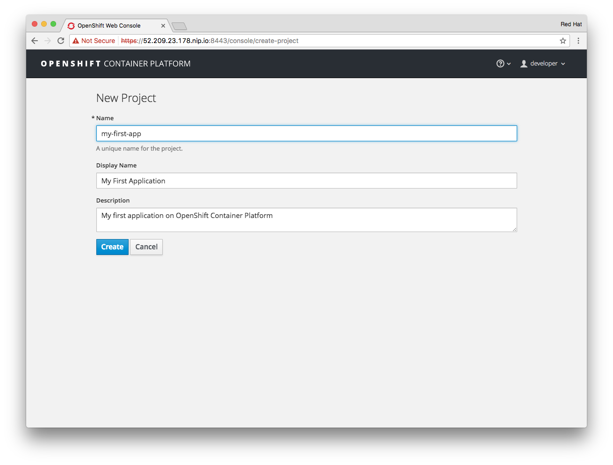
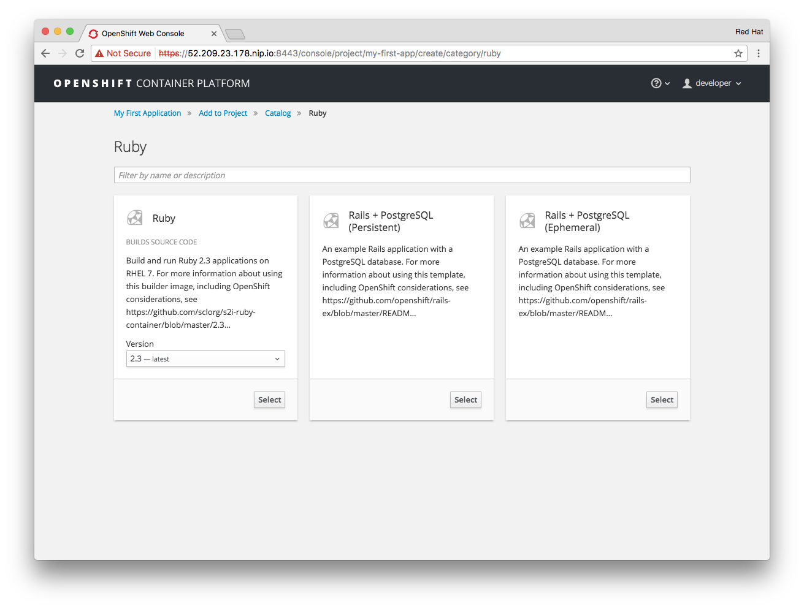

!!! Summary "Overview"
    This module is a *crash course* in OpenShift intended for Storage Solution Architects. You can safely skip this if you have existing working knowledge in OpenShift Container Platform

OpenShift in a nutshell
----------------------

*OpenShift Container Platform* (OCP) is Red Hat's productization of the Kubernetes project. 80% of OpenShift is based on it.
Kubernetes is a container orchestration engine for running docker-formatted containers at scale in a distributed environment.

OpenShifts main purpose is to allow a developer to focus on writing applications. They can leave it to OpenShift how to schedule and run those.

In the simplest form, a user supplies a URL to a source code repository. OCP takes it from there. It will know how to build the application, how to package it in a container image, run one or more instances of that image and make the application accessible to the outside world.

---

Application Lifecycle with OpenShift
------------------------------------

Let's walk through the basic workflow at an example.

!!! Tip
    For each task we will provide instructions for the UI as well as the equivalent on the CLI.

##### Logging in

&#8680; Log on to the OpenShift User Interface with the URL and credentials provided in the [Overview section](../) section.

*click on the screenshot for better resolution*

The UI focusses mainly on the tasks a developer / user would carry out. Administrative tasks are CLI only.

!!! Note
    The `oc` client is the primary CLI tool to access and manipulate entities in an OpenShift deployment.
    Basic syntax is always `$ oc <command>`

&#8680; In parallel log on to the master node with it's public IP provided in the [Overview section](../) section. For this you use the pre-installed `oc` tool (OpenShift Client).

~~~~
ssh -i ~/qwiklabs.pem -l ec2-user <your-public-IP>
~~~~

~~~~
oc login -u system:admin
~~~~
---

##### Exploring the environment

&#8680; First, display all available nodes in the system

    oc get nodes

You should see 7 nodes in **READY** state:

    NAME         STATUS    AGE
    master.lab   Ready     1h
    node-1.lab   Ready     1h
    node-2.lab   Ready     1h
    node-3.lab   Ready     1h
    node-4.lab   Ready     1h
    node-5.lab   Ready     1h
    node-6.lab   Ready     1h

&#8680; A slight variant of that command will show us some tags (called *labels*):

    oc get nodes --show-labels

You should see that 1 node has the label `region=infra` applied whereas the other 6 have `region=apps` and additionally `storagenode=glusterfs` set:

    NAME         STATUS    AGE       LABELS
    master.lab   Ready     1h        beta.kubernetes.io/arch=amd64,beta.kubernetes.io/os=linux,kubernetes.io/hostname=master.lab,region=infra
    node-1.lab   Ready     1h        beta.kubernetes.io/arch=amd64,beta.kubernetes.io/os=linux,kubernetes.io/hostname=node-1.lab,region=apps,storagenode=glusterfs
    node-2.lab   Ready     1h        beta.kubernetes.io/arch=amd64,beta.kubernetes.io/os=linux,kubernetes.io/hostname=node-2.lab,region=apps,storagenode=glusterfs
    node-3.lab   Ready     1h        beta.kubernetes.io/arch=amd64,beta.kubernetes.io/os=linux,kubernetes.io/hostname=node-3.lab,region=apps,storagenode=glusterfs
    node-4.lab   Ready     1h        beta.kubernetes.io/arch=amd64,beta.kubernetes.io/os=linux,kubernetes.io/hostname=node-4.lab,region=apps,storagenode=glusterfs
    node-5.lab   Ready     1h        beta.kubernetes.io/arch=amd64,beta.kubernetes.io/os=linux,kubernetes.io/hostname=node-5.lab,region=apps,storagenode=glusterfs
    node-6.lab   Ready     1h        beta.kubernetes.io/arch=amd64,beta.kubernetes.io/os=linux,kubernetes.io/hostname=node-6.lab,region=apps,storagenode=glusterfs

These are the "physical" systems available to OpenShift. One of them is special: the master. It runs important system services like schedulers, container registries and a database. Labels on hosts are used as a selector for scheduling decisions.
Non-master nodes run containerized applications.

&#8680; Display the current project context or namespace:

    oc project

You should be in the default namespace:

    Using project "default" on server "https://master.lab:8443".

&#8680; Display the running containers in this namespace.

    oc get pods

!!! Note:
    Containers are not the smallest entity OpenShift/Kubernetes knows about. **Pods** are. Pods typically run a single container only and are subject to scheduling, networking and storage configuration.
    There are some corner cases in which multiple containers run in a single pod. Then they share a single IP address, all storage and are always scheduled together.

You should have the 3 default services running in pods that every OpenShift deployment has:

    NAME                       READY     STATUS    RESTARTS   AGE
    docker-registry-1-rktxs    1/1       Running   0          1h
    registry-console-1-28hlh   1/1       Running   0          1h
    router-1-0btlh             1/1       Running   0          1h

The registry is where images that get created in OpenShift are stored. The registry console is a Web UI for the container registry. The router is an HAproxy instance running internally in OpenShift, exposing applications to the external network.

&#8680; Finally get more information about the deployment with this command:

    oc status

You see output similar to this:

    In project default on server https://master.lab:8443

    https://docker-registry-default.cloudapps.34.198.122.20.nip.io (passthrough) (svc/docker-registry)
    dc/docker-registry deploys docker.io/openshift3/ose-docker-registry:v3.5.5.15
    deployment #1 deployed 2 hours ago - 1 pod

    svc/kubernetes - 172.30.0.1 ports 443, 53->8053, 53->8053

    https://registry-console-default.cloudapps.34.198.122.20.nip.io (passthrough) (svc/registry-console)
    dc/registry-console deploys registry.access.redhat.com/openshift3/registry-console:3.5
    deployment #1 deployed 2 hours ago - 1 pod

    svc/router - 172.30.63.192 ports 80, 443, 1936
    dc/router deploys docker.io/openshift3/ose-haproxy-router:v3.5.5.15
    deployment #1 deployed 2 hours ago - 1 pod

    View details with 'oc describe <resource>/<name>' or list everything with 'oc get all'.

If these 3 pods are in place your environment is working.

---

##### Creating a Project

Similar to OpenStack *Projects* exists in OpenShift. They group users, objects and quotas in the system. They are also called *namespaces*. Nothing can exist outside a project/namespace.

&#8680; Select *Create Project* in the UI. Enter at least a system name, optionally a human-readable name (label) and a description.

&#8680; On the CLI create a project with the `oc` client.

    oc new-project my-first-application \
      --display-name="My First Application" \
      --description="My first application on OpenShift Container Platform"

---

##### Creating an Application

In the UI you should be looking at the following overview page:

If not, click on the OpenShift Product Logo in the upper left hand corner, select your project again and select *Add to Project*.

&#8680; From the catalog select the category *Ruby* from the group of available runtime environments.

OpenShift ships a number of useful example of simple and more complex application stacks in the form of templates. These are a great way to see how OpenShift does application development and deployment.

&#8680; Select the example app template labeled **Rails + PostgreSQL (Ephemeral)**
