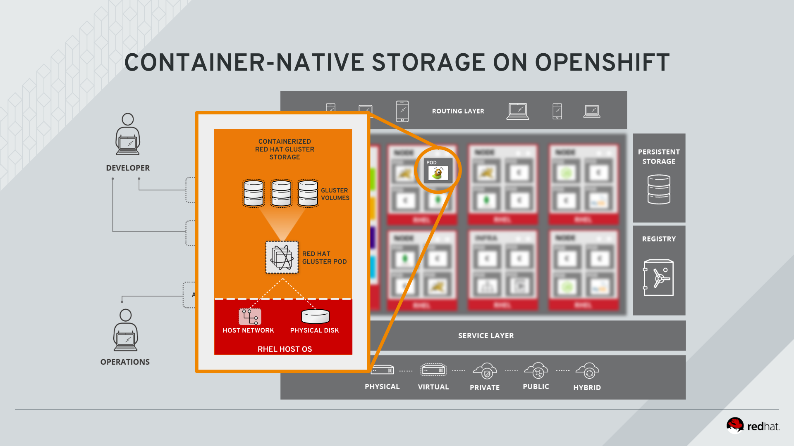
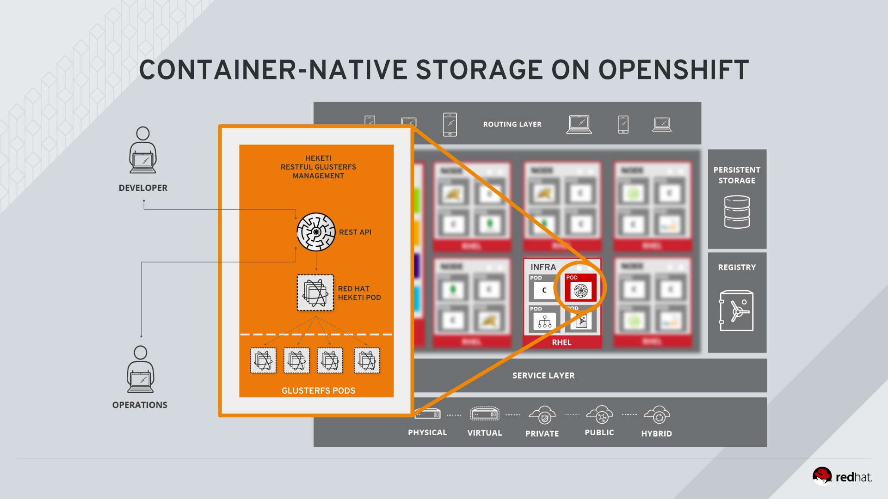

Deploying Container-native Storage
==================================

!!! Summary "Overview"
    In this section you will set up container-native storage (CNS) in your OpenShift environment. You will use this to dynamically provision storage to be available to workloads in OpenShift. It is provided by GlusterFS running in containers. GlusterFS in turn is backed by local storage available to the OpenShift nodes.

    At the end of this module you will have 3 GlusterFS pods running together with the heketi API frontend properly integrated into OpenShift.

!!! Caution
    All of the following tasks are carried out as the ec2-user from the master node. For Copy & Paste convenience we will omit the shell prompt unless necessary.

    All files created can be stored in root’s home directory unless a particular path is specified.


&#x3009;Make sure you are logged on as the `ec2-user` to the master node:

    [ec2-user@master ~]$ hostname -f
    master.lab

&#x3009;First install the CNS deployment tool:

    sudo yum -y install cns-deploy

Configure OpenShift Node firewall with Ansible
----------------------------------------------

!!! Hint
    In the following we will use Ansible's configuration management capabilities in order to make sure all the OpenShift nodes have the right firewall settings. This is for your convenience.
    Ansible is already present because the OpenShift installer makes heavy use of it.

    Alternatively you can manually configure each nodes iptables configuration to open ports 2222/tcp, 24007-24008/tcp and 49152-49664/tcp.


---
&#x3009;You should be able to ping all hosts using Ansible:

    ansible nodes -m ping

All 6 OpenShift application nodes should respond


    node3.example.com | SUCCESS => {
        "changed": false,
        "ping": "pong"
    }
    node2.example.com | SUCCESS => {
        "changed": false,
        "ping": "pong"
    }
    node1.example.com | SUCCESS => {
        "changed": false,
        "ping": "pong"
    }


&#x3009;Next, create a file called `configure-firewall.yml` and copy&paste the following contents:

<kbd>configure-firewall.yml:</kbd>
```yaml
---

- hosts: nodes

  tasks:

    - name: insert iptables rules required for GlusterFS
      blockinfile:
        dest: /etc/sysconfig/iptables
        block: |
          -A OS_FIREWALL_ALLOW -p tcp -m state --state NEW -m tcp --dport 24007 -j ACCEPT
          -A OS_FIREWALL_ALLOW -p tcp -m state --state NEW -m tcp --dport 24008 -j ACCEPT
          -A OS_FIREWALL_ALLOW -p tcp -m state --state NEW -m tcp --dport 2222 -j ACCEPT
          -A OS_FIREWALL_ALLOW -p tcp -m state --state NEW -m multiport --dports 49152:49664 -j ACCEPT
        insertbefore: "^COMMIT"

    - name: reload iptables
      systemd:
        name: iptables
        state: reloaded

...
```

Done. This small playbook will save us some work in configuring the firewall top open required ports for CNS on each individual node.

&#x3009;Run it with the following command:

    ansible-playbook configure-firewall.yml

Your output should look like this.

    PLAY [nodes] *******************************************************************

    TASK [setup] *******************************************************************
    ok: [node2.example.com]
    ok: [node1.example.com]
    ok: [node3.example.com]

    TASK [insert iptables rules required for GlusterFS] ****************************
    changed: [node3.example.com]
    changed: [node2.example.com]
    changed: [node1.example.com]

    TASK [reload iptables] *********************************************************
    changed: [node2.example.com]
    changed: [node1.example.com]
    changed: [node3.example.com]

    PLAY RECAP *********************************************************************
    node1.example.com          : ok=3    changed=2    unreachable=0    failed=0
    node2.example.com          : ok=3    changed=2    unreachable=0    failed=0
    node3.example.com          : ok=3    changed=2    unreachable=0    failed=0


---

With this we checked the requirement for additional firewall ports to be opened on the OpenShift app nodes.

Prepare OpenShift for CNS
-------------------------

Next we will create a namespace (also referred to as a *Project*) in OpenShift. It will be used to group the GlusterFS pods.

&#x3009;For this you need to be logged as an admin user in OpenShift.

    [ec2-user@master ~]# oc whoami
    system:admin

&#x3009;If you are for some reason not an admin, login as system admin like this:

    oc login -u system:admin -n default

&#x3009;Create a namespace with a designation of your choice. In this example we will use `container-native-storage`.

    oc new-project container-native-storage

GlusterFS pods need access to the physical block devices on the host. Hence they need elevated permissions.

&#x3009;Enable containers to run in privileged mode:

    oadm policy add-scc-to-user privileged -z default

Build Container-native Storage Topology
---------------------------------------

CNS will virtualize locally attached block storage on the OpenShift App nodes. In order to deploy you will need to supply the installer with information about where to find these nodes and what network and which block devices to use.  
This is done using JSON file describing the topology of your OpenShift deployment.

For this purpose, create the file topology.json like the example below. The hostnames, device paths and zone IDs are already correct. Replace the IP addresses with the ones from your environment.

!!! Warning
    The IP addresses will be different in your environment as they are dynamically allocated. Please refer to `/etc/hosts` for the correct mapping.

<kbd>topology.json:</kbd>

```json
{
    "clusters": [
        {
            "nodes": [
                {
                    "node": {
                        "hostnames": {
                            "manage": [
                                "node-1.lab"
                            ],
                            "storage": [
                                "192.168.0.102"
                            ]
                        },
                        "zone": 1
                    },
                    "devices": [
                        "/dev/vdc"
                    ]
                },
                {
                    "node": {
                        "hostnames": {
                            "manage": [
                                "node-2.lab"
                            ],
                            "storage": [
                                "192.168.0.103"
                            ]
                        },
                        "zone": 2
                    },
                    "devices": [
                        "/dev/vdc"
                    ]
                },
                {
                    "node": {
                        "hostnames": {
                            "manage": [
                                "node-3.lab"
                            ],
                            "storage": [
                                "192.168.0.104"
                            ]
                        },
                        "zone": 3
                    },
                    "devices": [
                        "/dev/vdc"
                    ]
                }
            ]
        }
    ]
}
```

!!! Tip "What is the zone ID for?"

    Next to the obvious information like fully-qualified hostnames, IP address and device names required for Gluster the topology contains an additional property called `zone` per node.

    A zone identifies a failure domain. In CNS data is always replicated 3 times. Reflecting these by zone IDs as arbitrary but distinct numerical values allows CNS to ensure that two copies are never stored on nodes in the same failure domain.

    This information is considered when building new volumes, expanding existing volumes or replacing bricks in degraded volumes.
    An example for failure domains are AWS Availability Zones or physical servers sharing the same PDU.

---

Deploy Container-native Storage
-------------------------------

You are now ready to deploy CNS. Alongside GlusterFS pods the API front-end known as **heketi** is deployed. By default it runs without any authentication layer.
To protect the API from unauthorized access we will define passwords for the `admin` and `user` role in heketi like below. We will refer to these later again.

|Heketi Role | Password |
|------------| -------- |
| admin      | myS3cr3tpassw0rd |
|user        | mys3rs3cr3tpassw0rd |


&#x3009;Next start the deployment routine with the following command:

    cns-deploy -n container-native-storage -g topology.json --admin-key 'myS3cr3tpassw0rd' --user-key 'mys3rs3cr3tpassw0rd'

Answer the interactive prompt with **Y**.

!!! Note:
    The deployment will take several minutes to complete. You may want to monitor the progress in parallel also in the OpenShift UI in the `container-native-storage` project.

On the command line the output should look like this:

~~~~ hl_lines="27 40 41 42 44 50 52 54 69 71"
Welcome to the deployment tool for GlusterFS on Kubernetes and OpenShift.

Before getting started, this script has some requirements of the execution
environment and of the container platform that you should verify.

The client machine that will run this script must have:
 * Administrative access to an existing Kubernetes or OpenShift cluster
 * Access to a python interpreter 'python'
 * Access to the heketi client 'heketi-cli'

Each of the nodes that will host GlusterFS must also have appropriate firewall
rules for the required GlusterFS ports:
 * 2222  - sshd (if running GlusterFS in a pod)
 * 24007 - GlusterFS Daemon
 * 24008 - GlusterFS Management
 * 49152 to 49251 - Each brick for every volume on the host requires its own
   port. For every new brick, one new port will be used starting at 49152. We
   recommend a default range of 49152-49251 on each host, though you can adjust
   this to fit your needs.

In addition, for an OpenShift deployment you must:
 * Have 'cluster_admin' role on the administrative account doing the deployment
 * Add the 'default' and 'router' Service Accounts to the 'privileged' SCC
 * Have a router deployed that is configured to allow apps to access services
   running in the cluster

Do you wish to proceed with deployment? Y
[Y]es, [N]o? [Default: Y]:

Using OpenShift CLI.
NAME                       STATUS    AGE
container-native-storage   Active    28m
Using namespace "container-native-storage".
Checking that heketi pod is not running ... OK
template "deploy-heketi" created
serviceaccount "heketi-service-account" created
template "heketi" created
template "glusterfs" created
role "edit" added: "system:serviceaccount:container-native-storage:heketi-service-account"
node "node1.example.com" labeled
node "node2.example.com" labeled
node "node3.example.com" labeled
daemonset "glusterfs" created
Waiting for GlusterFS pods to start ... OK
service "deploy-heketi" created
route "deploy-heketi" created
deploymentconfig "deploy-heketi" created
Waiting for deploy-heketi pod to start ... OK
Creating cluster ... ID: 307f708621f4e0c9eda962b713272e81
Creating node node1.example.com ... ID: f60a225a16e8678d5ef69afb4815e417
Adding device /dev/vdc ... OK
Creating node node2.example.com ... ID: 13b7c17c541069862d7e66d142ab789e
Adding device /dev/vdc ... OK
Creating node node3.example.com ... ID: 5a6fbe5eb1864e711f8bd9b0cb5946ea
Adding device /dev/vdc ... OK
heketi topology loaded.
Saving heketi-storage.json
secret "heketi-storage-secret" created
endpoints "heketi-storage-endpoints" created
service "heketi-storage-endpoints" created
job "heketi-storage-copy-job" created
deploymentconfig "deploy-heketi" deleted
route "deploy-heketi" deleted
service "deploy-heketi" deleted
job "heketi-storage-copy-job" deleted
pod "deploy-heketi-1-599rc" deleted
secret "heketi-storage-secret" deleted
service "heketi" created
route "heketi" created
deploymentconfig "heketi" created
Waiting for heketi pod to start ... OK
heketi is now running.
Ready to create and provide GlusterFS volumes.
~~~~

In order of the appearance of the highlighted lines above in a nutshell what happens here is the following:

-   Enter **Y** and press Enter.

-   OpenShift nodes are labeled. Label is referred to in a DaemonSet.

-   GlusterFS daemonset is started. DaemonSet means: start exactly **one** pod per node.

-   All nodes will be referenced in heketi’s database by a UUID. Node block devices are formatted for mounting by GlusterFS.

-   A public route is created for the heketi pod to expose it's API.

-   heketi is deployed in a pod as well.


---

Verifying the deployment
------------------------

You now have deployed CNS. Let’s verify all components are in place.

&#x3009;If not already there on the CLI change back to the `container-native-storage` namespace:

    oc project container-native-storage

&#x3009;List all running pods:

    oc get pods -o wide

You should see all pods up and running. Highlighted containerized gluster daemons on each pods carry the IP of the OpenShift node they are running on.

~~~~ hl_lines="2 3 4"
NAME              READY     STATUS    RESTARTS   AGE       IP              NODE
glusterfs-37vn8   1/1       Running   0          3m       192.168.0.102   node1.example.com
glusterfs-cq68l   1/1       Running   0          3m       192.168.0.103   node2.example.com
glusterfs-m9fvl   1/1       Running   0          3m       192.168.0.104   node3.example.com
heketi-1-cd032    1/1       Running   0          1m       10.130.0.4      node3.example.com
~~~~

!!! Note
    The exact pod names will be different in your environment, since they are auto-generated.

The GlusterFS pods use the hosts network and disk devices to run the software-defined storage system. Hence they attached to the host’s network. See schematic below for a visualization.

[](img/cns_diagram_pod.svg)

*heketi* is a component that will expose an API for GlusterFS to OpenShift. This allows OpenShift to dynamically allocate storage from CNS in a programmatic fashion. See below for a visualization. Note that for simplicity, in our example heketi runs on the OpenShift App nodes, not on the Infra node.

[](img/cns_diagram_heketi.svg)

To expose heketi’s API a `service` named *heketi* has been generated in OpenShift.

&#x3009;Check the service with:

    oc get service/heketi

The output should look similar to the below:

    NAME      CLUSTER-IP     EXTERNAL-IP   PORT(S)    AGE
    heketi    172.30.5.231   <none>        8080/TCP   31m

To also use heketi outside of OpenShift in addition to the service a route has been deployed.

&#x3009;Display the route with:

    oc get route/heketi

The output should look similar to the below:

    [ec2-user@master ~]# oc get route/heketi
    NAME      HOST/PORT                                               PATH      SERVICES   PORT      TERMINATION   WILDCARD
    heketi    heketi-container-native-storage.cloudapps.example.com             heketi     <all>                   None

Based on this *heketi* will be available on this URL:
<http://heketi-container-native-storage.cloudapps.example.com>

&#x3009;You may verify this with a trivial health check:

    curl http://heketi-container-native-storage.cloudapps.example.com/hello

This should say:

    Hello from Heketi

With this you have successfully verified the deployed components.
